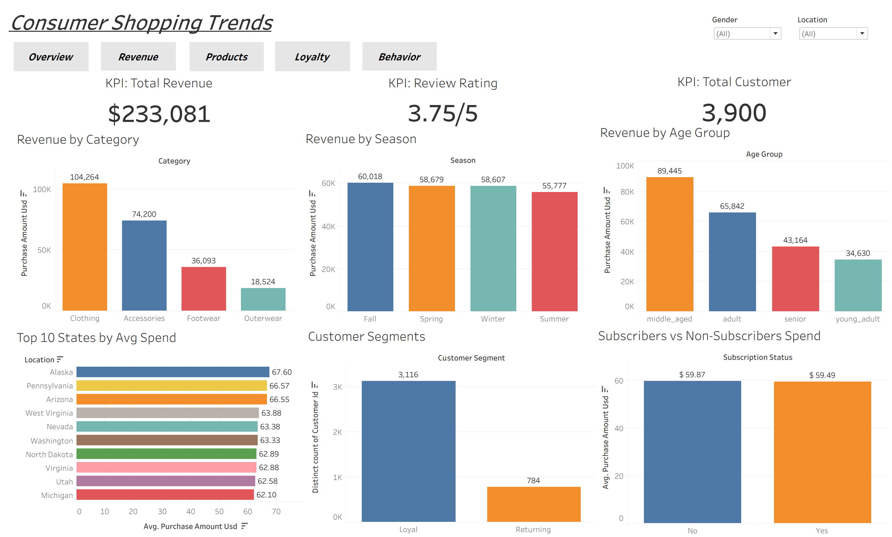
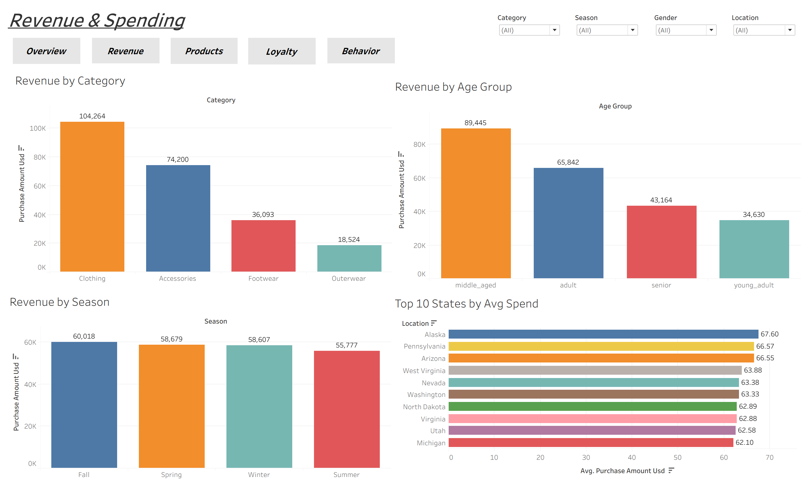
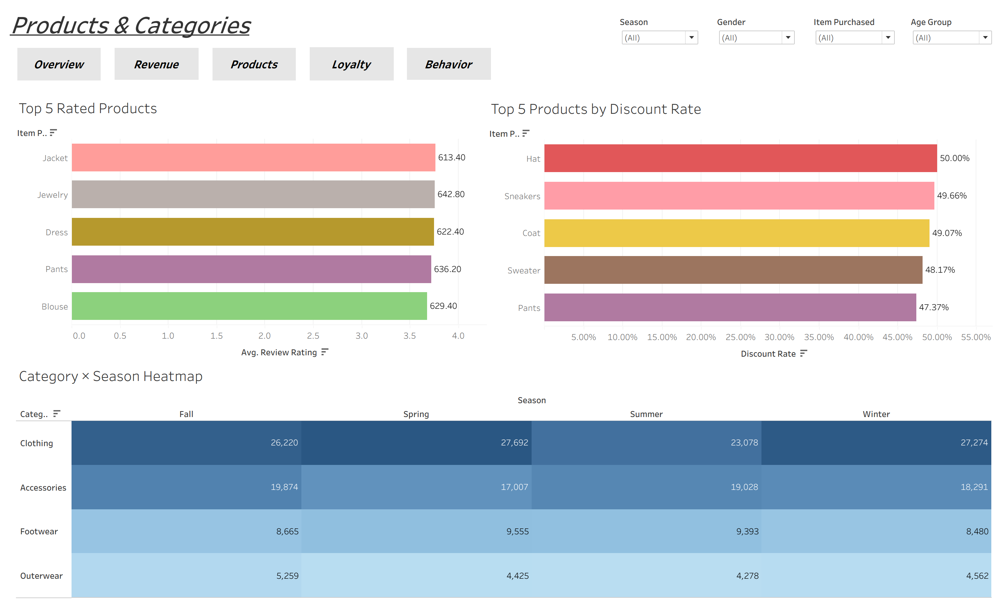
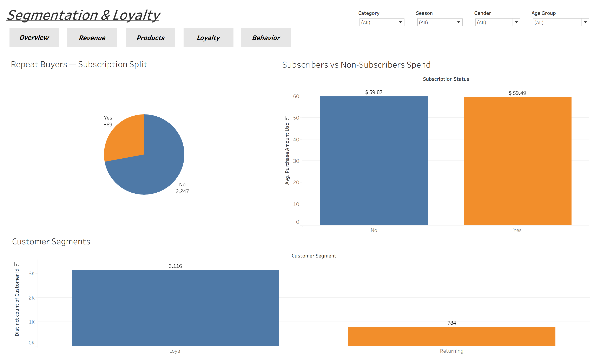

# Customer Shopping Trend Analysis

An end-to-end retail analytics project on a 3,900-row consumer shopping dataset. Raw data is cleaned and feature-engineered in Python/pandas, explored in SQL Server through 15 business-framed queries, and visualised in an interactive four-dashboard Tableau workbook covering revenue drivers, product performance, customer segmentation, and behavioural patterns.

## Project workflow

```
Raw CSV  ──►  Python / pandas cleaning  ──►  cleaned CSV  ──►  SQL Server EDA  ──►  Tableau dashboards
 (3,900 rows)   (impute, standardize,         (source of        (15 queries,        (4 dashboards,
                 feature-engineer)             truth)            4 themes)           17 worksheets)
```

## Dataset

`customer_shopping_behavior.csv` — 3,900 rows, 18 columns of retail transaction data spanning customer demographics (age, gender, location), purchase details (item, category, amount, season), and behaviour fields (subscription status, discount usage, payment method, purchase frequency, review rating).

## Phase 1 — Data cleaning & feature engineering (Python)

Handled in `Customer_Shopping_Trend_Analysis.ipynb`:

- **Missing values.** `review_rating` was the only column with nulls — 37 of 3,900 rows (~0.9%). Imputed each using the **median rating within the row's own category**, rather than a single global median, so filled values stay consistent with how each category tends to be rated.
- **Column standardization.** All 18 headers normalized to lowercase `snake_case` (e.g. `Purchase Amount (USD)` → `purchase_amount_usd`) so they're safe to reference directly in both pandas and SQL without quoting.
- **Feature engineering:**
  - `age_group` — continuous age bucketed into four labelled cohorts (`young_adult`, `adult`, `middle_aged`, `senior`) via `pd.cut` for interpretable cohort comparison.
  - `purchase_frequency_days` — the categorical `frequency_of_purchases` label (`Weekly`, `Monthly`, `Annually`, …) mapped to a numeric days-between-purchases value, making frequency directly rankable.
- **Redundancy check.** `discount_applied` and `promo_code_used` were confirmed identical across all 3,900 rows, so the redundant `promo_code_used` was dropped.

The cleaned frame is exported to `cleaned_customer_trend.csv`, the single source of truth for the SQL and Tableau phases.

## Phase 2 — Exploratory analysis (SQL Server)

`customer_shopping_trend_analysis.sql` contains 15 queries in four themes, each preceded by the business question it answers and a note on why that framing was chosen.

1. **Revenue & spending patterns** — revenue by gender; above-average discount users; spend by shipping type; revenue by age group; top locations by *average* revenue per customer.
2. **Product & category performance** — top-rated products; highest discount-rate products; top 3 products within each category (`ROW_NUMBER … PARTITION BY`); leading category per season (`RANK`).
3. **Customer segmentation & loyalty** — subscriber vs non-subscriber spend; New/Returning/Loyal segmentation; subscription rates among repeat buyers; frequency-vs-spend relationship.
4. **Behavioural & cross-factor analysis** — discount usage vs review rating; average spend by payment method.

## Phase 3 — Interactive dashboards (Tableau)

`Customer-Shopping-Behavior-Analysis.twb` builds on the cleaned dataset with **17 worksheets** assembled into **4 dashboards**, mirroring the SQL analysis themes:

| Dashboard | What it shows |
| :--- | :--- |
| **Consumer Shopping Trends** | Executive overview — KPI tiles (total revenue, total customers, avg review rating) with headline revenue and segment views |
| **Revenue & Spending** | Revenue by category, season, gender, and age group; top 10 states by average spend; spend by shipping type and payment method |
| **Products & Categories** | Top-rated products, highest discount-rate products, and a category × season heatmap |
| **Segmentation & Loyalty** | Customer segments, subscribers vs non-subscribers, repeat-buyer subscription split, and discount-vs-full-price ratings |

Three dedicated KPI worksheets (`Total Revenue`, `Total Customer`, `Review Rating`) act as summary tiles across the overview.

## Dashboard previews

**Tableau Public Link:** https://public.tableau.com/views/CustomerShoppingTrendAnalysis_17830116490660/ConsumerShoppingTrends?:language=en-US&:sid=&:redirect=auth&:display_count=n&:origin=viz_share_link 

> Exported from the Tableau workbook.

**Executive overview**


**Revenue & Spending**


**Products & Categories**


**Segmentation & Loyalty**


**Behavioral & Cross-Factor**


## Techniques demonstrated

Python (pandas cleaning, imputation, `pd.cut` binning, categorical→numeric mapping) · SQL (conditional aggregation, subqueries, CTEs, `ROW_NUMBER`/`RANK` with `PARTITION BY`) · Tableau (KPI tiles, heatmaps, multi-dashboard layout, calculated fields such as `Discount Rate` and `Is Repeat Buyer`).

## Repository contents

| File | What it is |
| :--- | :--- |
| `Customer_Shopping_Trend_Analysis.ipynb` | Phase 1 — Python cleaning & feature engineering |
| `customer_shopping_trend_analysis.sql` | Phase 2 — 15-query SQL Server EDA |
| `Customer-Shopping-Behavior-Analysis.twb` | Phase 3 — Tableau workbook (4 dashboards, 17 worksheets) |
| `customer_shopping_trend.csv` | Dataset |
| `Report_CSTA.pdf` | Written analysis report |
| `Consumer_Shopping_Trends_Presentation.pptx` | Summary presentation deck |
| `images/` | Dashboard screenshots referenced above |
| `LICENSE` | MIT |

## How to reproduce

1. Run the notebook top to bottom to reproduce the cleaning and export `cleaned_customer_trend.csv`.
2. Load that CSV into a SQL Server table named `customer` and run `customer_shopping_trend_analysis.sql` in SSMS.
3. Open the `.twb` in Tableau Desktop / Public (it points at the cleaned CSV) to explore the dashboards.

> Built on Python 3 (pandas), Microsoft SQL Server (T-SQL), and Tableau.

## Tech stack

Python · pandas · Microsoft SQL Server · T-SQL · Tableau · Jupyter
